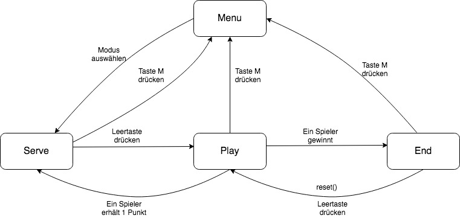
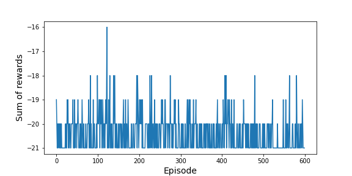

## 1. Motivation

#### Einführung

In dem vorliegenden Projekt geht es um die Entwicklung des Spiels Pong. Pong wurde in 1972 von Atari veröffentlicht und zum einem ersten weltweit beliebten Videospiel. Die Spielregel besteht darin, dass jeder Spieler sein eigens Paddel steuert, den Ball zu schlagen. Jedes Mal, wenn ein Spieler den Ball in Richtung des Gegners ins Aus schlägt, erhält er einen Punkt. Derjenige, der zuerst 11 Punkte erreicht, gewinnt das Spiel.

#### Zielsetzung

Das Ziel dieses Projekts ist es nicht nur, das konventionelle Pong, bei dem zwei Spieler gegeneinander spielen, nachzuahmen, sondern auch den Computer in die Lage zu versetzen, dieses Spiel automatisch zu spielen. Damit werden zwei Spielmodi zur Verfügung gestellt, nämlich 1-Spieler- und 2-Spieler-Modus. 

Im 2-Spieler-Modus steuert jeder Spieler sein eigenes Paddel, um den Ball zu schlagen, während der Rechner im 1-Spieler-Modus das rechte Paddel steuert und sich je nach Schwierigkeitsgrad unterschiedlich verhält. Dabei soll man vor dem Beginn einen Schwierigkeitsgrad auswählen. Außerdem soll eine grafische Oberfläche im Spielprogramm entwickelt werden, die das Spielerlebnis befördert.

## 2. Entwurf

#### Struktur

Das Projekt wird mittels Python umgesetzt. Es wird die Pygame-Bibliothek verwendet, die für die Spielprogrammierung gedacht ist. Die Struktur wird so ausgewählt, dass das Programm den hohen Grad an Modularität aufweist. Das Programm wird in einzelne Module, Komponenten unterteilt. Der Grund für diese Wahl ist es, das Projekt einfach zu kontrollieren, debuggen und pflegen, wenn es im Laufe der Entwicklung wächst. Darüber hinaus sind Komponenten auch wiederverwendbar.

```python
/pongAI

	/components

		ball.py

		menu.py

		paddle.py

		scoreboard.py

	/status

		game_mode.py

		game_state.py

	main.py
	...
```

Die Klasse *PongGame* in der Datei *main.py* steht in Zentrum des Programms und hat Zugriff auf alle Klassen bzw Komponenten. Es ist für das Render und die Spiellogik zuständig, z.B. Steuerung des Balls im Fall einer Kollision, Aktualisieren der ändernden Komponenten im Bildschirm oder Kontrolle der Spielschleife usw. Es besitzt die Funktion *run_game*, die alle Aktionen in der Spielschleife steuert und viele verschiedene Hilfsfunktionen, die mit einem Unterstrich am Anfang ihres Namens gekennzeichnet sind. Diese Hilfsfunktionen fördert wiederum die Aktraktion des Programm.

```python
def run_game(self):
        while True:
            self._check_events()
            if self.current_state == GameState.PLAY:
                if self.current_mode == GameMode.ONE_PLAYER_DIFFCULT:
                    self._update_diff_mode()
                elif self.current_mode == GameMode.ONE_PLAYER_EASY:
                    self._update_easy_mode()
                self.paddle1.update()
                self.paddle2.update()
                self._update_ball()
                self._update_score()
            self._update_screen()
```

In diesem Programmabschnitt lässt es sich erkennen, dass interaktive Ereignisse zunächst ständig geprüft werden. Bevor das Spiel beginnt, muss ein Spielmodus ausgewählt werden. Die Steuerung der Paddel hängt von dem ausgewählten Modus ab. Im 2-Spieler-Modus kann man das ersten bzw. linke Paddel mit den Tasten W und S und das zweite bzw. rechte mit den Tasten UP und DOWN steuern. Diese Einstellung wird in der Hilfsfunktion *_check_events()* vorgenommen.  Im 1-Spieler Modus hingegen steuert man nur das linke und das rechte bewegt sich automatisch, wofür die beide Hilfsfunktionen *_update_diff_mode* und *_update_easy_mode* sorgen. Im Anschluss werden die Positionen der einzelnen Komponenten aktualisiert und schließlich auf dem Bildschirm angezeigt. 

#### Spielzustände

Das Spiel besteht aus 4 Zuständen, nämlich MENU, SERVE, PLAY, END

MENU: Das Menü wird angezeigt, um ein Spielmodus ausgewählt zu werden

SERVE: Beginn einer Runde. Die Leertaste soll gerdrückt werden, um den Ball aufzuschlagen.

PLAY: Das Spiel beginnt. Die Paddel sowie das Ball bewegen sich und die Punkte werden berechnet. Dieser Zustand beendet, wenn ein Spieler einen Punkt erhält oder gewinnt.

END: Das Spiel beendet, solange ein Spieler 11 Punkte erreicht.





#### 1-Spieler-modus 

**ONE_PLAYER_DIFFICULT: **Das rechte Paddel wurde so programmiert, dass es dem Ball relativ zu seiner y-Position folgt. In dieser Einstellung kann der Gegner als unschlagbar angesehen werden und verliert nur dann, wenn der Ball zu schnell für das Paddel ist, um ihn zu treffen.

**ONE_PLAYER_EASY: **Eine Menge Trainingsbeispiele (Bx, By, Vx, Vy, Py) wird vom **ONE_PLAYER_DIFFICULT** gesammelt und in ein neuronales Netz eingespeist. Dieses neuronale Netze sagt dann die Wahrscheinlichkeit einer Abwärtsbewegung vorher und steuert sein Paddle entsprechend. Die Architektur umfasst 5 Einheiten in der Eingabeschicht, 16 Einheiten in der verborgenen Schicht mit der Aktivierung reLU und 1 Einheiten in der Ausgabeschicht mit der Aktivierung sigmoid. Alle Schichten sind vollständig verbunden. Im Projekt findet man das Notebook unter dem Verzeichnis *model*, in dem das Modell trainiert wird.

## 3. Ergebnisse und Diskussion

**Schwierigkeiten**

Der Stand der Technik besteht darin, einen Agenten in einer Umgebung zu trainieren, in der er viele verschiedene Zustände durchläuft und Aktionen ausführt, um die Belohnung zu maximieren. Im Laufe der Entwicklung wurde die Umgebung Pong-V0 von OpenAI experimentiert. Dort wurde die Technik DeepQ-Learning eingesetzt und ein CNN-Modell aufgebaut, das die Differenz zwischen dem vorherigen und aktuellen Frame als Eingabe aufnimmt und die Wahrscheinlichkeit von 6 Aktionen produziert. Das Modell wird in 600 Episoden trainiert, zeigt aber am Ende keine gute Leistung. 



Das Modell wird dann exportiert und in der lokalen Umgebung spielen lassen, wobei der Screenshot ständig vorverarbeitet wird. Infolgedessen schneidet es auch extrem schlecht ab. Vielleicht ist das Training nicht ausreichend. Aus diesem Grund wird dieses Modell vom Projekt ausgeschlossen. . 

**Einschränkungen**

Das Modell, das momentan im Projekt verwendet wird, ist einfach. Allerdings hat es folgende Einschränkungen

- Es kann nicht so gut generalisieren, weil es die Pixels lediglich von dieser lokalen Umgebung learnt. Ändert man die Einstellung wie z.B. die Bildschirmgröße, die Geschwindigkeit des Balls, funktioniert es nicht mehr. 
- Es kann den Ball teilweise schlagen, nur wenn die Geschwindigkeit des Paddels auf 4 gesetzt wird. Diese Geschwindigkeit wird nur im Modus **ONE_PLAYER_EASY** eingestellt.
- Die Punkte werden nicht berücksichtigt, die normalerweise als Belohnung im Reinforcement-Lernen verwendet können. Das. Modell bildet zu jeder Zeit nur die Pixeldaten auf eine Aktion, ohne belohnt oder bestraft zu werden.
- Man muss eine Menge Trainingsbeispiele sammeln, was keine ideale Lösung für KI-Probleme im Spiel ist, weil so viele unterschiedliche Zustände normalerweise in einem Spiel bestehen.

**Ausblick**

In Zukunft kann das Programm noch verbessert werden. Da sind einige mögliche Lösungen.

- Den Agenten in der Umgebung von OpenAI länger trainieren. Das kann ein paare Tage dauern.
- Es gibt noch viele Technik, die man selbst experimentieren kann. z.B: Policy Network, Double Deep-Q,..

- Eine Umgebung selbst einzurichten und den Agent mit DeepQ-Learning lokal zu trainieren ist möglich, aber sehr aufwändig.

Aufgrund der mangelnden Erfahrung und der begrenzten Zeit und Ressourcen werden diese Ideen noch nicht umgesetzt. Zusammenfassend lässt sich sagen, dass Reinforcement Learning auch ein komplexer Thema ist und viele Recherchen erfordert. Des Weiteren benötigt Ein KI-Agent eine lange Trainingszeit und spezielle Hardware, um gute Leistungen zu erbringen.

## 4. Los geht's

Python-Version 3.8.2 ist für dieses Projekt erforderlich

**Erzeugen einer virtuelle Umgebung**

```python
virtualenv venv
```

**Aktivieren der virtuellen Umgebung**

```python
source venv/bin/activate
```

**Installation der nötigen Pakten**

```python
pip install -r requirements.txt
```

**Starten**

```py
python3 main.py
```

**Deaktivieren der virtuellen Umgebung**

```python
deactivate
```

